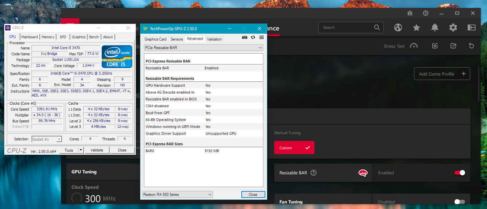

# ReBarUEFI
DXE driver to enable Resizable BAR on systems which don't support it officially. This is done by hooking ```PreprocessController``` which is called for every PCI device during boot and setting up the Resizable BAR control registers.


### Requirements
* PCIe 3.0 (Ivy Bridge+)
* 4G Decoding enabled
* (optional) BIOS support for Large BARs (often limited to 2GB)


### Usage
Use [UEFITool (non NE)](https://github.com/LongSoft/UEFITool/releases/tag/0.28.0) to insert the FFS from [Releases](https://github.com/xCuri0/ReBarUEFI/releases) into the end of the DXE driver section and flash the modified firmware.

For more information on inserting FFS DXE modules you can check the guide for inserting NVMe modules on [win-raid forum](https://winraid.level1techs.com/t/howto-get-full-nvme-support-for-all-systems-with-an-ami-uefi-bios/30901).


Once running the modified firmware and 4G Decoding is enabled run ReBarState (found in Releases) and set the Resizable BAR size.

### UEFI Patching
Most UEFI firmwares have problems handling BARs larger than 2GB so several patches were created to fix these issues. You can use [UEFIPatch](https://github.com/LongSoft/UEFITool/releases/tag/0.28.0) to apply these patches located in the UEFIPatch folder. Some patches which may cause issues are commented and need to be manually uncommented.

#### Working patches
* <4GB BAR size limit removal
* <16GB BAR size limit removal
* Increase MMIO space from 16GB to full usage of 64GB range (Ivy Bridge) (may require DSDT modification so commented by default). See wiki page [DSDT Patching](https://github.com/xCuri0/ReBarUEFI/wiki/DSDT-Patching) for more information.

#### ASUS no boot after patching
Using UEFIPatch can cause issues with the 16 byte aligned modules in ASUS firmwares (see UEFITool [bug #231](https://github.com/LongSoft/UEFITool/issues/231)). 

You can workaround this by extracting the modified DXE driver module FFS (extract as-is) in UEFITool and using MMTool on an unpatched BIOS to replace the same module with the extracted FFS. Thanks [@romulus2k4](https://github.com/romulus2k4) for discovering and testing this method.

### Build
Use the provided buildffs.py script after cloning inside an edk2 tree to build the DXE driver. ReBarState can be built on Windows or Linux using CMake. See wiki page [Building](https://github.com/xCuri0/ReBarUEFI/wiki/Building) for more information.

### FAQ
#### Why don't BAR sizes above x size work ?
If you can't use 4GB and larger sizes it means your BIOS doesn't support large BARs. If you can't use above 1GB then either 4G decoding is disabled or your BIOS isn't allocating your GPU in the 64-bit region. Patches exist to fix some of these issues.

#### Will less than optimal BAR sizes still give a performance increase ?
On my system with an i5 3470 and Sapphire Nitro+ RX 580 8GB with Nimez drivers/registry edit I get an upto 12% FPS increase with 2GB BAR size. It appears AMD requires a minimum of 2GB BAR for the driver to take advantage of it not sure about Nvidia.

#### I set an unsupported BAR size and my system won't boot
CMOS reset should fix it but in some motherboards it doesn't which means you will have to either boot with iGPU only or use BIOS flashback/recovery.

#### Will it work on x system ?
As long as you have 4G decode try it and see. If you don't have 4G decode visible you can check the hidden BIOS settings with [Universal IFR Extractor](https://github.com/LongSoft/Universal-IFR-Extractor/releases) and set it using [grub-mod-setup_var](https://github.com/datasone/grub-mod-setup_var).

### Credit
Linux kernel especially the amdgpu driver

EDK2 for the base that all OEM UEFI follows making hooking easier

QEMU/OVMF made testing hooking way easier although it doesn't have resizable BAR devices
