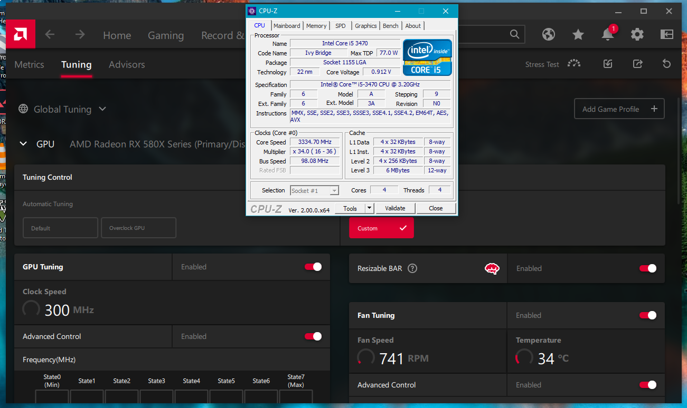
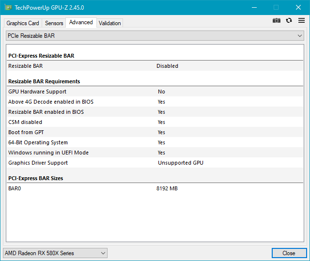

# ReBarUEFI
Setup resizable BAR and then load Windows. WIP if you want to build this you need to change the hardcoded addresses for it to work on your system. 

Tested and working on Sapphire Nitro+ RX 580 8GB, Gigabyte B75M-D3H (F16 BIOS 4G decoding on) and i5 3470. 

Minimum requirements should be PCIE 3.0 (Ivy Bridge and newer), supported GPU and 4G decoding on with sufficient free address space. Visual corruption on Windows boot screen is normal and should display properly once GPU driver loads.




## Build / QEMU testing
copy this folder into edk2 tree. add ```ReBarUEFI/ReBar.inf``` to [Components] in OvmfPkg/OvmfPkgX64.dsc

while it's not possible to test resizable BAR under QEMU you can test reading the BAR range/size and bridge windows

make sure to change ISO path for the second QEMU CDROM
```
build --platform=OvmfPkg/OvmfPkgX64.dsc --arch=X64 --buildtarget=RELEASE --tagname=GCC5 && cp ../Build/OvmfX64/RELEASE_GCC5/X64/ReBar.efi .

sudo ./geniso.sh 

qemu-system-x86_64 -machine q35,accel=kvm -bios /usr/share/ovmf/OVMF.fd -m 1024M -drive file=./uefi.iso,index=0,media=cdrom -drive file=./arch22.07.01.iso,index=1,media=cdrom -device pci-bridge,id=bridge0,chassis_nr=1 -device virtio-scsi-pci,id=scsi0,bus=bridge0,addr=0x3
```
